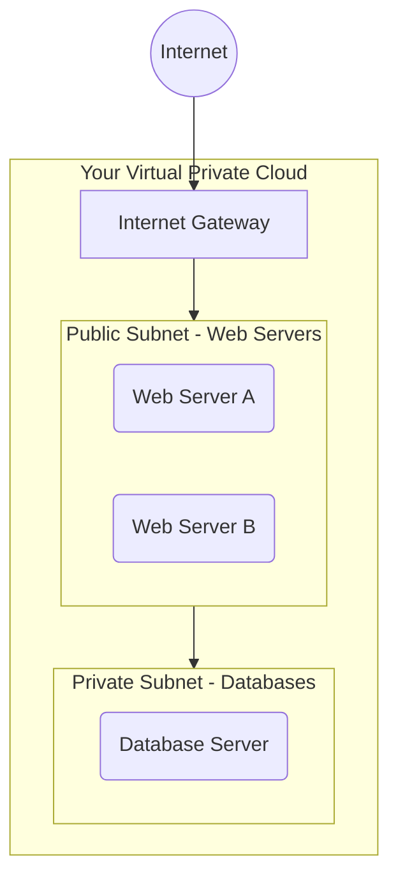

## What is the Cloud?

Think of the "Cloud" as a giant, highly secure apartment building for computers, managed by a really efficient landlord (like AWS, Google, or Microsoft). Instead of buying a house (a physical server) and paying for all the maintenance, security, and electricity, you just rent an apartment (a Virtual Machine) and only pay for the time you're living in it.

### Virtual Machines (VMs)

A Virtual Machine is exactly what it sounds like. It's a computer inside a computer. The cloud landlord has massive physical servers, and they use special software to carve them up into smaller, isolated "virtual" computers that you can rent.

- **Analogy:** Renting a specific room in a large house. You have your own lock, your own stuff, but you share the same foundation and roof.

### Networking 101: VPCs and Subnets

When you spin up computers in the cloud, they need a way to talk to each other safely.

1. **VPC (Virtual Private Cloud):** This is the fence around your property. It’s your own private slice of the cloud. No one else can get in unless you specifically open a gate.
2. **Subnets:** These are the rooms inside your fenced property. You might have a "public" room (where anyone can knock on the door, like a web server) and a "private" room (where only family members can go, like a database).

## Architecture Visualized

Here is a visual representation of how these pieces fit together:

## AI as your Mentor: Making Cloud Decisions

Now, let's look at how AI helps you navigate this. You might be asked to deploy an application, but you aren't sure which cloud provider to pick.

**Prompting Strategy for AI:**
When asking an AI (like Claude or Gemini) for architecture advice, provide the **context**, **constraints**, and ask for **trade-offs**.

> **Example Prompt:**
> "I am a college student building a small side project. My budget is $10/month, and I don't have time to manage complex infrastructure. Should I use AWS EC2 (VMs) or a Platform-as-a-Service like Heroku or Vercel? Please provide a simple pros and cons list and make a recommendation based on my budget and time constraints."

**Why this works:** The AI can instantly weigh the trade-offs. It will likely tell you that while VMs are cheaper on paper, managing them takes time, and a PaaS (Platform as a Service) is better for your specific constraints.

This is how AI empowers you: it accelerates the decision-making process so you can focus on building the product.
