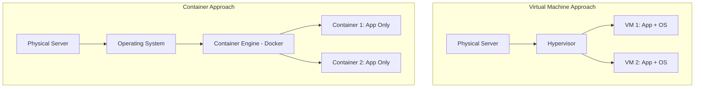

## What are Containers?

If Virtual Machines (VMs) are like renting an entire apartment, **Containers** are like the sturdy, stackable wooden boxes used for shipping goods across the ocean.

Imagine you're shipping a grand piano and a box of fragile glasses. If you throw them in the same truck without boxes, they'll break each other. A "Container" is the sturdy box that keeps your piano safe regardless of what else is in the truck. In the world of software, your "piano" is your application, and the "truck" is the server it runs on.

### Containers vs. Virtual Machines

While a VM includes a whole operating system (the heavy landlord’s furniture), a Container only includes exactly what your application needs to run—the code, the libraries, and the settings. This makes them much smaller and faster.

- **VM Analogy:** Renting a fully furnished apartment. It has everything, but it's heavy and expensive.
- **Container Analogy:** Packing your essentials into a suitcase. You can carry it anywhere and it works the same way whether you're in a hotel or at home.

## Architecture Visualized

Here is a visual comparison of how Containers and VMs sit on a physical server:

## Why Docker?

Docker is the tool we use to build, ship, and run these containers. It’s like the standardized shipping container system that revolutionized global trade. Before Docker, software was hard to move between different servers. Now, "if it runs on my machine, it runs in the cloud."

## AI as your Mentor: Optimizing for the Cloud

One of the most important skills in infrastructure is keeping your containers "slim" and "secure." Large containers are slow to deploy and have more places for hackers to hide.

**Prompting Strategy for AI:**
Instead of asking AI to "Write a Dockerfile for a Node.js app," ask it to help you **optimize** and **explain** the security trade-offs.

> **Example Prompt:**
> "I have a simple Node.js application. I want to build a Dockerfile that is as small as possible and follows security best practices (like not running as root). Can you help me write a **multi-stage Dockerfile** and explain why each stage is necessary? Also, explain why using an 'Alpine' base image might be better for security."

**Why this works:** The AI acts as a Senior Engineer mentor. It won't just give you code; it will teach you about **multi-stage builds** (separating the building of code from the running of code) and **security hardening** (using minimal base images).

This is how AI empowers you: it helps you write production-grade infrastructure code from day one.
